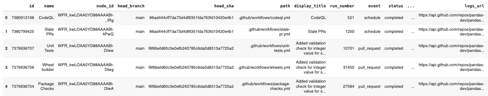
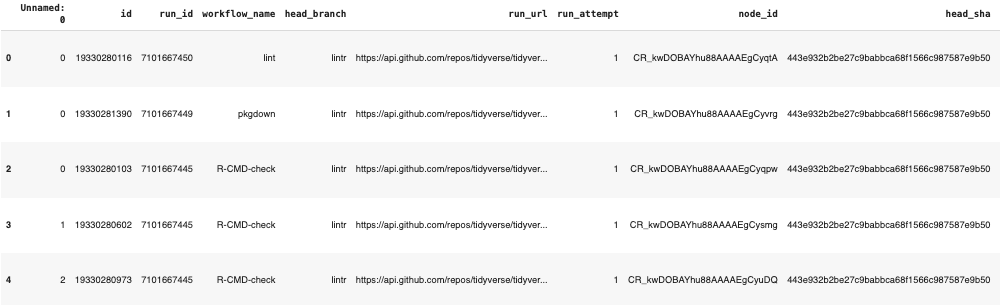
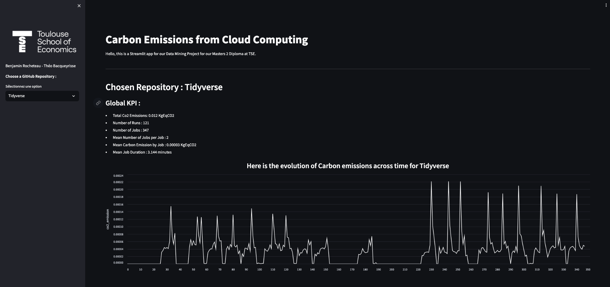
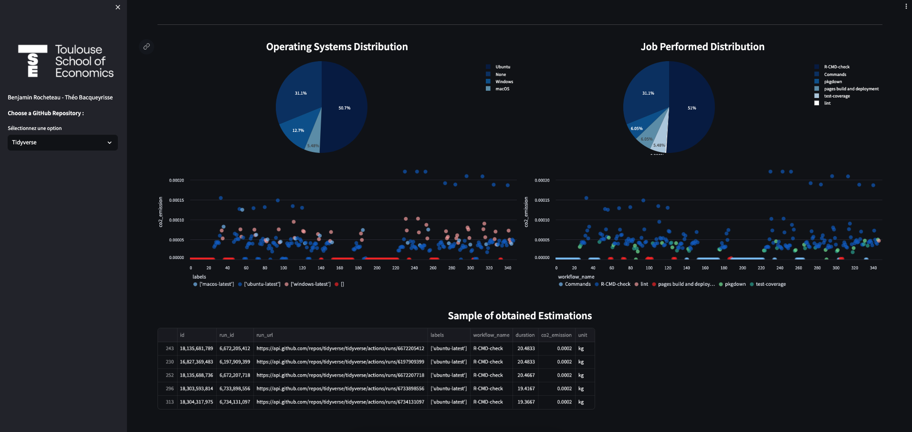

# Predicting the Carbon Cost of Cloud Computing
Project 10: Continuous Integration Carbon Footprint - Théo Bacqueyrisse & Benjamin Rocheteau

## Table of Contents

1. [Introduction](#introduction)
2. [GitHub API](#github-api)
3. [Climatiq API](#climatiq-api)
4. [The Code](#the-code)
5. [The App](#the-app)
6. [Shortcomings and Future Initiatives](#shortcomings-and-future-initiatives)

## Introduction

Nowadays, a lot of different projects are created by developpers and are made open source, for example through a Python package, to be usable by any programmer or data scientist. These projects enable the user to efficiently solve problems in their specific use case. For example, a project like Matplotlib, which is open-source and hosted on Github, is very well known to perform data vizualisation tasks efficiently.

Such projects are also made public to be continuously improved, with bug corrections and new features being regularly implemented. Such changes can be proposed by the programming community, who bring in a lot of new ideas, are part of relevant discussions, and detect problems very quickly. They can also be part of the project by proposing changes to be made to a project. In this way, the programming community can actively participate in the conception and improvement of a project. 

This process is called Continuous Integration, making the changes made to a shared repository very efficient and open to new ideas.  It is a huge asset for the progress of programming possibilities in our opinion, which has been exponential for a few years and will surely yield incredible new features in the future.

But we also know that the growth of this area presents some major drawbacks, one of which being the carbon dioxyde emissions generated by the energy consumed by the variety of elements related to these activities. For example, for a data scientist, training a deep learning model can take a great amount of time, and can consume a lot of electricity, especially with the use of Graphical Processing Units (GPU) and servers. 

But a tremendous part of the emissions come from the servers on which are stored any programming object such as datasets or projects. In the frame of Continuous Integration, the projects available on GitHub that are updated regularly are stored in servers, and fixing these projects come at a cost, that is electricity emission from the unit that performs the update during the necessary runtime, which in turn induces carbon emission. Because the projects are numerous, and the updates are regular and possibily long, the carbon emissions coming from Continuous Integration are important to consider. Indeed, in our climate crisis context, controlling carbon emissions from every possible aspect is crucial to limit global warming. 

We believe that the technological progress made in the field of programming can be a huge source of value to help tackle these climate challenges, but having an overview of the costs of this progress is important, as it may give insights on the source of highest emissions for example, so that the processes could be optimized in the future in regards to carbon emission.

In this project, we develop a solution to estimate the carbon emissions from a GitHub repository using Continuous Integration, and we present some insights of these emissions using a Streamlit app.

## GitHub API

### Collect the Workflow Runs from a Repository

The cloud computing emissions for a project hosted on GitHub come from the workflows of changes made to this GitHub repository. These workflows can be found in the *GitHub Actions* tab of an **public** repository. If the chosen repository is working with Continuous Integration, a list of runs will be displayed describing what are the changes that were made to the repository, ranked by dates of updates.

The first process to be created is the collection of these workflows in Python, which can be done by using the GitHub Rest API, enabling us to collect various data from GitHub. This collection needs a GitHub Personal Access Token, giving access to the workflow runs of an open-source repository. Such a token can be created by any GitHub user in their *Developer Settings*. 

First of all, in order to collect the runs of a given repository, we have to use the *user_name* of the repository owner and the *name_repo* of the repository, as well as define our GitHub token value : 

Here is an example if choosing to collect the runs from the Pandas repository.

```python
username = "pandas-dev"
name_repo = "pandas"
token = "************************"
```

Using the GitHub Rest API, **only 100 runs can be collected per API call**. This is why we defined our process using two functions :

- First, we coded a function to obtain 100 runs from a repository. Since the runs are organized by page, we use a parameter $page_number$ to be given in the function call. Then, by displaying 100 runs by page, we collect the runs of the given $page_number$. Here is the python code for this function :


```python
def get_workflows_from_repo(token, user_name, name_repo, page_nb):

  url = f'https://api.github.com/repos/{user_name}/{name_repo}/actions/runs?per_page=100&page={page_nb}'

  cmd = 'curl -G -H f"Authorization: token {token_git}" {url}'
  os.system(cmd.format(token_git = token, url = url))

  headers = {'Authorization': f'token {token}'}
  response = requests.get(url, headers=headers)

  if response.status_code == 200:
      workflows_data = response.json()
  else:
      print(f"Échec de la requête avec le code d'état {response.status_code}")

  return pd.DataFrame(workflows_data['workflow_runs'])
```

This function first defines the url from where to recover the runs. We see that we set here the parameters *per_page=100* and the *page = page_nb*. Then, we execute a command line, which connects to the GitHub Rest API with our GitHub token, and recovers the dataframe located at the specified url with a *requests.get*. The obtained data is in json format, and we return it in form of a Pandas dataframe for the second function.

- Then, using this first function, we coded another function that calls the first function for every page number until we get our first empty page of runs. The function thus sends a Pandas dataframe at each API call composed of 100 rows / runs, and this dataframe is concatenated with a general Pandas dataframe at each step. This process can take a long time for heavy repositories. For example, we collected the runs for the *Numpy* repository composed of around 100,000 runs, and the function took around 4 hours to run in colab. A lighter repository, *Tidyverse*, took around 5 minutes to obtain. Here is the code we used :

```python
def get_all_workflows_from_repo(token, username, name_repo):

  df_final = pd.DataFrame()
  page_nb = 1
  while True:
    df = get_workflows_from_repo(token, username, name_repo, page_nb)

    if df.empty :
      break

    page_nb += 1
    df_final = pd.concat([df_final, df], axis = 0)

  return df_final
```
```python
df = get_all_workflows_from_repo(token, username, name_repo)
```

This is how the dataset obtained looks like for the *Pandas* repository: 

<p>

</p>

This dataset contains :

- The run_id to identify the different runs 
- The event of the run (can be a pull request for example)
- The duration of the update
- The result of the modification
- Branchs' information as the modification could have been tested in a sub-branch before being pushed on the main branch
- Other information


At the end of this function, we added an option to send this dataset containing all the runs from the chosen repository to our [Google Drive file](https://drive.google.com/drive/folders/16rD7bP4xZZ5GKvw-5t8xnh3eD2T3TxSt).

This file will be used later for our Streamlit application, and it is useful to save our files to avoid re-running this piece of code.

### Collect the Jobs that were Performed in each Run

The next step for our estimation was to try to go deeper into the tasks that are performed during each run. In GitHub, these tasks are called Jobs, and detail the different steps in a Run that brings a change to a given repository. The jobs are available for recovery using the GitHub Rest API again, using a similar process than for the runs. 

However, we did not find a way to recover the jobs using a batched API call. This means that our current method is performing an API call for each of the runs in a repository. So when working with *Numpy* for example, we would have to make more than 100,000 API calls to recover the jobs. When trying to do so, we faced a computational issue making the jobs recovery very hard for big repositories. 

This is the function that we used for our attempt : 

```python
def get_jobs_from_run(token, username, name_repo, df_runs):

  df_jobs = pd.DataFrame()

  for i in df_runs['id']:

    url = f'https://api.github.com/repos/{username}/{name_repo}/actions/runs/{i}/jobs'

    cmd = f'curl -L \
      -H "Accept: application/vnd.github+json" \
      -H f"Authorization: Bearer {token}" \
      -H "X-GitHub-Api-Version: 2022-11-28" \
      {url}'

    os.system(cmd)

    headers = {'Authorization': f'token {token}'}
    response = requests.get(url, headers=headers)

    if response.status_code == 200:
        run_id_jobs = response.json()
    else:
        print(f"Échec de la requête avec le code d'état {response.status_code}")
        continue

    df_jobs = pd.concat([df_jobs, pd.DataFrame(run_id_jobs['jobs'])], axis = 0)
  return df_jobs
```
This function first defines the url to get the jobs from. We see that in this parameter we have to specify the *run_id* to be analyzed, which is responsible for the fact that we can recover jobs from only one run with 1 API call. Then, it executes a command line to connect to GitHub Rest using the GitHub token, and collecting the searched dataset from the url in form of a json dataframe that we convert into a pandas dataframe. We then concatenate the obtained data with a general dataset at each step. 

We tried two different approaches with this method : 

- First, we tried to recover all the jobs at once by just running the function.

- Then, we tried to perform batches of recovery using slices of indexes of the datasets containing the runs.

Unfortunately, both approaches failed for big repositories, due to memory issues or API calls limitaition. This process may be possible to optimize, first by making sort each step does not perform a concatenation of datasets that use a big amount of memory in the process. This optimization may be part of a next step for this project.

For *Tidyverse*, however, we were able to recover the jobs for the mearly 350 runs in the repository. Here is what the obtained dataset looks like : 

<p>

</p>

This data contains information on :

- The *run_id* related to the job
- The git branch on which the change is being made
- Details on the job
- The status of the specific change of the job, that is completed or not 
- The success (or not) of the update 
- The duration of the update 
- The runners from which the update comes from, so the operating system of the developer that started the change (Ubuntu, Windows, macOS)
- Other information are provided

In fact, for carbon emission estimations, the duration of the Jobs or Runs is what we are most interested in, and additional information will help us to understand the details of these emissions.

## Climatiq API

Once we have the job durations and runners, the final task is to obtain the carbon emissions from these jobs. After doing some research, we found that the GitHub servers hosting the public repositories are located on the west coast of the USA. Also, these repositories use Azure as cloud computing provider, with generally a single Central Processing Unit (CPU). Knowing that, we wanted to use the Climatiq API, which can estimate the carbon emission from a task given the duration of the task, the number of CPUs used, the region (being west_us here), and the cloud computing provider of this task as parameters. The cloud provider is given in the final endpoint (url) we want to access.

This estiamation is done by computing the watts emissions from the job described in the API call, and then translate this electricity consumption into carbon emissions with an emission factor (which is equal to 0.0009 KgEqCo2/Cpu-hour in the west coast of the USA.)

Note that however, access to an API key for Climatiq, giving access to cloud computing estimations is restricted, and we thank the Climatiq team for letting us access this feature for the time of our project.

Once we had an appropriate API key, we ran the following script : 

```python

def get_co2_emissions_from_jobs(df_jobs):
  climatiq_url = 'https://beta4.api.climatiq.io/compute/azure/cpu'
  co2_ems = []
  for i in range(len(df_jobs)):
    dur_job = df_jobs.iloc[i]['duration']

    data = {
    "cpu_count": 1,
    "region": "west_us",
    "duration": dur_job,
    "duration_unit": "h",
    }

    data = json.dumps(data)

    header = {
        'Authorization': f'Bearer {apikey_climatiq}',
    }

    response = requests.post(climatiq_url, headers=header, data=data)

    if response.status_code == 200:
        api_response = response.json()
    else:
        print(f"Failed to fetch data. Status code: {response.status_code}")
        print(response.text)
    co2_ems.append(api_response['co2e'])

  df_jobs['co2_emission'] = co2_ems
  df_jobs['unit'] = 'kg'

  return df_jobs
```
Note that this API also has its limits in term of computing power, and the script to collect all of Pandas data for example crashed due to the number of rows in the data, demanding an important number of API calls. This process should also be optimized, through batch calls for example, but we did not yet find a way to do so.

The script adds two columns to our dataset : `co2_emission` and `unit`, which gives us the carbon emission estimate for each run. The unit generally used for carbon emission is the KgEqCo2, so this is the unit we display here. After this step, the collection of the emissions estimates is complete, and the data is ready to be analyzed.

## The App

We thought that an appropriate way to present the results we obtained was through a Streamlit app, that would give insights to the emissions of some repositories of various sizes for which we estimated the emisssions. Streamlit is an intuitive tool that allows the user to vizualise a lot of information interactively. 

In this app, we let the user choose the repository he wants to visualize results from. However, we only included the repositories for which we have data stored in our Drive file, as recovering data for any repository live while using the app would be very long to run, and thus troublesome. The user can thus choose between our 3 examples repositories (Numpy, Pandas, and Tidyverse) and visualize general KPI on the repository emissions from cloud computing, as well as plots to illustrate the temmporal aspects of emissions, or the other factors related to them such as the runner of the update (Windows, macOS, Ubuntu). We also plot the carbon emissions in function of these diverse factors to give insights on which factors cause the highest emissions.

Finally, we display a sample of the data we collected for the user to see what it looks like. Here is an example of this app : 

<div style="text-align:center;">
    
</div>
<div style="text-align:center;">
    
</div>

This example illustrates the results we obtained with Tidyverse. We see for example that all the changes using Continuous Integration produced approximately 0.012 kg of carbon dioxyde. Bu we see other interesting results :

- It appears that the highest emissions are done with an Ubuntu runner, though some lower emissions are also with an Ubuntu runner. However, runs with Windows tend to produce a stable amount of Carbon. It could be worth to check deeper insights to check if there are other explanations, or if the runner is truly a determinant for the carbon emissions 

- Also, we see that the tasks *R-CMD-Check* are the one producing the most carbon dioxyde, whereas *pkgdown*, *test_coverage* or *pages build and development* tasks produce very low amount of carbon.

We also found interesting features with our Numpy data, even without the Jobs of each runs being collected. Note that the app page for Numpy is a bit long to load due to data recovery from drive being of 1.19 Go.

- First, the Continuous Integration in this rpeository produced from our estimations around 10kg of carbon dioxyde.

- Then, the *workflow_dispatch* and *schedule* are the tasks that have the highest mean emissions with 0.0007 and 0.0005 KgEqCo2 repectively.

- Finally, the runs that failed produced in average 3 times the amount of carbon dioxyde than successful or even cancelled runs. This result is crucial to us. Indeed, it shows that to limit a repository carbon footprint, a major task for developpers is to be confident that the integration will not fail, or at least monitor it to stop it soon if a fail is suspected. In fact even though failed runs represent around 5% of runs, the carbon emissions coming from failure are more than 1.5 kg of carbon, so around 15% of emissions.

- It is also important to note that this result is not always true. For the Pandas repository, failed runs are not a big part of the emissions. Also, since we took only the last 50,000 runs from the repository, and that these runs emitted more than 15 kg of carbon dioxyde, we can suppose that the number of runs is not entirely responsible for the total emissions of a repository, meaning that the tasks performed are of great importance for them.

- We also constated that even if different repositories have similar types of tasks (like Pull Requests, Push, ...), the duration of these tasks may vary greatly, as Pandas tasks are in average three times longer than Numpy tasks for example. Maybe it is related to the magnitude of the change that is done on the repository, suggesting again that it would need to go deeper inside the performed tasks.


## Shortcomings and Future Initiatives

Our project has a lot of room for growth, which we feel the need to address. 

The first potential direction of growth is the extraordinary amount of time our code takes to run. For any repository bigger than tiny, the code takes hours to run, and quite often crashes due to a variety of issues: lack of memory, connection to the API being severed, and more. This leads our code to not always work, and often after hours of runtime. Some of these problems might be solved by the use of big data and parallelization techniques, which could possibly a future initiative for this project. 

The second direction of growth is on the analytical side of things: looking at the correlation between types of action and their emissions, and the code which comprises each type of action. If we can identify exactly which parts of CI/CD are the most energy intensive, we can have a better notion of how to reform the pipeline to be more environmentally friendly. 

The third direction of growth is on the practical side of things. In our folder `1_Functions`, there is an attempt to make a version of our code which can be run on it's own, ie the user executes `setup.py`, and can then immediately start calling our functions and using them either in the Python console, or in their own scripts. Unfortunately, when we test the code in `test_code.py`, we get scope issues involving our packages which we did not have time to resolve. 
